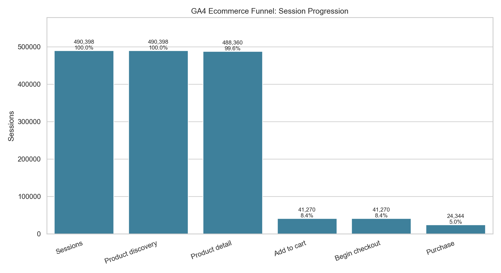
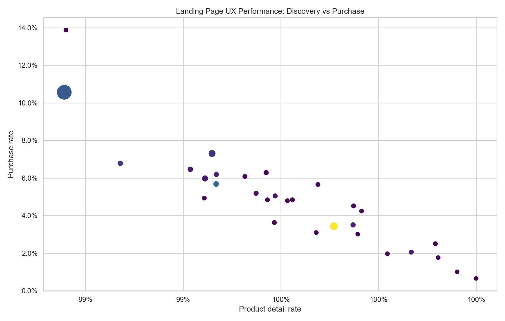
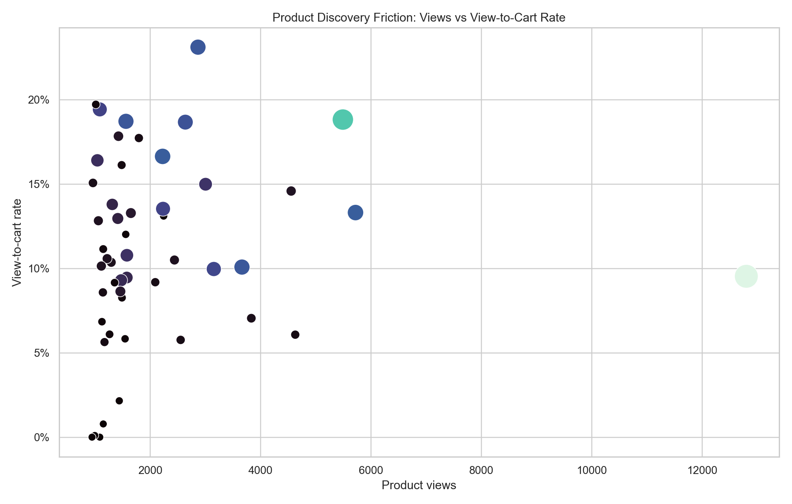
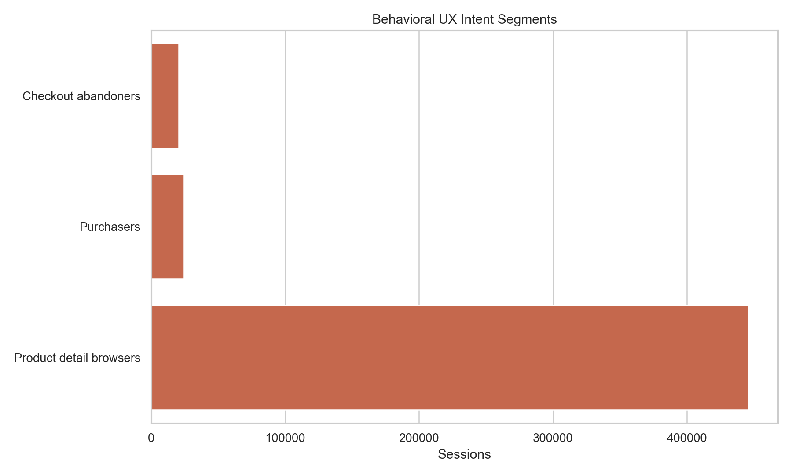
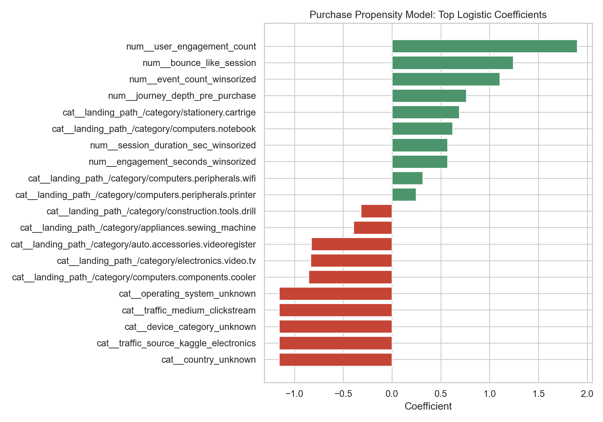
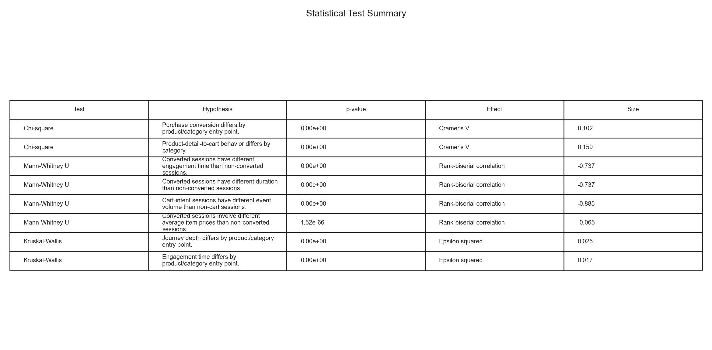

# Ecommerce UX Funnel Audit: Diagnosing Product Discovery Drop-Offs from Real Clickstream Data


> End-to-end UX and product analytics project diagnosing ecommerce conversion friction across product discovery, cart intent, purchase behavior, category performance, and high-intent non-purchasing segments.

---

## 1. Executive Summary

Ecommerce users often fail to purchase not because they never find products, but because product detail pages fail to create enough confidence, urgency, or clarity to move them into cart intent.

This project analyzes real ecommerce clickstream behavior to identify which stages of the customer journey create the largest conversion loss and which product/category segments deserve UX intervention.

**Key Takeaways:**

1. **Product Persuasion Is the Primary Bottleneck:** Nearly all sessions reach product detail behavior, but only **8.45%** of product-detail sessions add to cart. This creates a **91.55% drop-off** before cart intent.
2. **Cart Intent Is Valuable:** Once a session reaches cart intent, **58.99%** convert to purchase. The final purchase stage matters, but it is not the largest loss point.
3. **Category Quality Varies Meaningfully:** Product/category entry point is significantly associated with both cart behavior and purchase conversion. Videocards produce the strongest revenue/session profile.
4. **High-Intent Non-Buyers Are Detectable:** A train/test purchase propensity model identifies high-intent sessions that resemble buyers but fail to purchase, creating a practical UX review queue.
5. **Taxonomy Gaps Weaken Discovery:** The `unknown` category receives the most sessions but produces weak revenue per session, suggesting product metadata and navigation cleanup opportunities.

---

## Visual Gallery

<table>
<tr>
<td><br><sub>Overall Funnel Drop-Off</sub></td>
<td><br><sub>Landing/Category Performance Matrix</sub></td>
<td><br><sub>Product Friction Matrix</sub></td>
</tr>
<tr>
<td><br><sub>UX Intent Segments</sub></td>
<td><br><sub>Purchase Model Drivers</sub></td>
<td><br><sub>Statistical Test Summary</sub></td>
</tr>
</table>

---

## 2. Data Source

This project uses a real ecommerce clickstream dataset from an electronics store:

[Kaggle: eCommerce events history in electronics store](https://www.kaggle.com/datasets/mkechinov/ecommerce-events-history-in-electronics-store)

Executed dataset profile:

- **884,964 cleaned events**
- **490,398 sessions**
- **407,073 users**
- **793,589 view events**
- **54,029 cart events**
- **37,346 purchase events**
- **$5,125,395.62 observed purchase revenue**

Event taxonomy: the dataset includes `view`, `cart`, and `purchase` events. Cart behavior is treated as the measurable purchase-intent stage.

---

## 3. Methodology

This analysis uses a reproducible product analytics pipeline:

1. **Data Acquisition:** Downloaded and extracted real ecommerce clickstream event data.
2. **Sessionization:** Aggregated raw event rows into session-level behavioral records.
3. **Data Cleaning:** Removed invalid events, coerced numeric fields, normalized categories, handled missing metadata, and deduplicated sessions.
4. **Outlier Handling:** Applied 1.5x IQR winsorization to skewed session-duration, event-count, engagement, and revenue fields.
5. **Feature Engineering:** Created journey-depth, cart-intent, checkout-abandonment proxy, category-entry, product-breadth, bounce-like, and high-intent behavioral features.
6. **UX Segmentation:** Bucketed sessions into Product Detail Browsers, Cart-Intent Non-Buyers, and Purchasers.
7. **Statistical Testing:** Ran non-parametric tests, chi-square tests, normality checks, and correlation tests suited to the available clickstream fields.
8. **Predictive Modeling:** Trained a class-balanced logistic regression model with a train/test split to identify purchase-propensity drivers and high-intent non-purchasing segments.
9. **Recommendation Synthesis:** Translated the statistical and segment outputs into prioritized UX recommendations.

---

## 4. Results

### 4.1 Funnel Performance

| Step | Sessions | Share of Sessions | Step Conversion | Drop-Off |
|---|---:|---:|---:|---:|
| Sessions | 490,398 | 100.00% | 100.00% | 0.00% |
| Product discovery | 490,398 | 100.00% | 100.00% | 0.00% |
| Product detail | 488,360 | 99.58% | 99.58% | 0.42% |
| Add to cart | 41,270 | 8.42% | 8.45% | 91.55% |
| Checkout-intent proxy | 41,270 | 8.42% | 100.00% | 0.00% |
| Purchase | 24,344 | 4.96% | 58.99% | 41.01% |

The strongest finding is that the journey breaks before cart. Users are seeing products, but the product experience is not consistently persuasive enough to trigger cart intent.

### 4.2 Behavioral Segments

| Segment | Sessions | Interpretation |
|---|---:|---|
| Product Detail Browsers | 445,546 | View products but never add to cart. This is the largest UX friction group. |
| Cart-Intent Non-Buyers | 20,508 | Add products to cart but do not purchase. This is the strongest recovery/remarketing group. |
| Purchasers | 24,344 | Complete purchase behavior and generate **$210.54 revenue/session**. |

### 4.3 Category and Product Performance

Top category findings:

- `computers.components.videocards` generated **43,269 sessions**, **20.83% cart rate**, **10.57% purchase rate**, and **$58.96 revenue/session**.
- `unknown` generated the most sessions, **146,153**, but only **$3.46 revenue/session**, indicating taxonomy or discovery quality issues.
- `computers.components.cpu` showed strong commercial value with **$20.06 revenue/session**.

Product findings:

- `product_1821813` generated **12,804 views**, **538 purchases**, and **$213,844.24** revenue.
- `product_4099645` converted more efficiently than the top-viewed product, with **18.81% view-to-cart** and **10.27% view-to-purchase**.
- `product_893196` is a hidden high-converter, with **23.10% view-to-cart** and **13.40% view-to-purchase**.

---

## 5. Statistical Testing Results

The statistical analysis is complete for the available clickstream dataset.

Completed validation:

- **Normality checks:** Shapiro-Wilk checks on sampled session metrics showed non-normal distributions, supporting the use of non-parametric tests.
- **Chi-square tests:** Category entry point is significantly associated with purchase conversion and product-detail-to-cart behavior.
- **Mann-Whitney U tests:** Converted sessions differ materially from non-converted sessions in engagement/session duration; cart-intent sessions differ from non-cart sessions in event volume.
- **Kruskal-Wallis tests:** Journey depth and engagement differ by product/category entry point.
- **Spearman tests:** Event volume and unique product breadth are associated with deeper journey progression.

Selected test results:

| Hypothesis | Test | Result | Interpretation |
|---|---|---|---|
| Purchase conversion differs by category entry point | Chi-square | p < 0.001, Cramer's V = 0.102 | Category context is statistically associated with purchase behavior. |
| Product-detail-to-cart behavior differs by category | Chi-square | p < 0.001, Cramer's V = 0.159 | Product persuasion strength varies by category. |
| Converted sessions differ in duration | Mann-Whitney U | p < 0.001, rank-biserial = -0.737 | Converted sessions have materially different session-duration behavior. |
| Cart-intent sessions differ in event volume | Mann-Whitney U | p < 0.001, rank-biserial = -0.885 | Cart sessions are behaviorally deeper than non-cart sessions. |
| Journey depth differs by category | Kruskal-Wallis | p < 0.001, epsilon squared = 0.025 | Category explains a modest but real share of journey-depth variation. |
| Event volume relates to journey depth | Spearman | rho = 0.545, p < 0.001 | Event activity is moderately associated with deeper funnel progress. |

Full outputs:

```text
outputs/statistical_tests.csv
outputs/normality_checks.csv
outputs/08_statistical_test_summary.png
```

---

## 6. Predictive Modeling

The purchase propensity model uses a class-balanced logistic regression pipeline with train/test validation.

| Metric | Value |
|---|---:|
| Test rows | 122,600 |
| Accuracy | 94.39% |
| Precision | 46.82% |
| Recall | 95.43% |
| F1 | 62.82% |
| ROC AUC | 98.46% |
| Average precision | 74.51% |

Interpretation:

The model is strongest as a diagnostic tool. Because purchase is a rare outcome, precision is expectedly lower than recall, but the model is useful for identifying high-intent non-purchasing segments that should be investigated for UX friction.

---

## 7. How to Run

Install dependencies:

```bash
pip install -r requirements.txt
```

Prepare the executed Kaggle clickstream dataset:

```bash
python scripts/prepare_electronics_clickstream.py
```

Run the analysis:

```bash
python analysis.py
```

---

## 8. Project Structure

```text
ux_analytics/
├── README.md
├── findings.md
├── analysis.py
├── requirements.txt
├── scripts/
│   └── prepare_electronics_clickstream.py
├── data/
│   ├── raw/
│   └── processed/
├── outputs/
└── reports/
```

---

## 9. Potential Business Applications

This analysis framework can be adapted for:

- Product detail page UX audits
- Cart recovery and remarketing prioritization
- Category merchandising diagnostics
- Product ranking and hidden-winner discovery
- Conversion propensity scoring
- Product taxonomy cleanup prioritization
- Ecommerce funnel reporting and recurring product analytics diagnostics

---

## 10. Conclusion

The analysis shows that ecommerce conversion loss is concentrated before cart intent. The site is successful at exposing users to product detail pages, but many product experiences do not create enough confidence or perceived value to earn an add-to-cart action.

The highest-return intervention is therefore not only checkout optimization. It is improving the product persuasion layer: product-page clarity, category taxonomy, trust signals, compatibility information, review visibility, and promotion of high-converting products with lower visibility.
